#  Harry Potter RAG Chatbot

A Retrieval-Augmented Generation (RAG) chatbot that answers natural-language
questions about the **seven Harry Potter books**, grounded strictly in the book
text and showing **cited sources** (book + chapter) for every answer. When the
retrieved context doesn't cover a question, it refuses ("I don't know") instead
of hallucinating from the model's own knowledge.

- **Data-prep + evaluation notebook** (`notebooks/rag_pipeline.ipynb`)
- **FastAPI backend** (`/query`, `/health`, query router, grounding gate)
- **Streamlit chat frontend** (sources, health indicator, friendly errors)
- **Local embeddings + vector DB**: `sentence-transformers` + **Qdrant embedded
  mode** (no Docker). The **LLM is Groq** (hosted, fast) via `openai/gpt-oss-20b`.

---

## Architecture

```mermaid
flowchart LR
    subgraph Ingest["Phase 1 — Notebook (offline, one-time)"]
        PDF[["harry_potter_complete.pdf"]] --> Parse["Parse → Markdown<br/>(pymupdf4llm)"]
        Parse --> Clean["Clean text"]
        Clean --> Chunk["Chapter-aware chunking<br/>~220 tok, 15% overlap"]
        Chunk --> Embed["Embed<br/>all-MiniLM-L6-v2"]
        Embed --> Store[("Qdrant store<br/>+ config.json")]
    end

    subgraph Serve["Phases 2–4 — Runtime"]
        User(["User"]) -->|question| UI["Streamlit UI"]
        UI -->|POST /query| API["FastAPI"]
        API --> Router{"Query Router"}
        Router -->|greeting| Canned1["Canned reply"]
        Router -->|out_of_scope| Canned2["Polite decline"]
        Router -->|hp_question| Retrieve["Retrieve top-k"]
        Store -. loaded read-only .-> Retrieve
        Retrieve --> Gate{"score ≥ threshold?"}
        Gate -->|no| Refuse["I don't know"]
        Gate -->|yes| Prompt["Build grounded prompt"]
        Prompt --> LLM["Groq<br/>openai/gpt-oss-20b"]
        LLM --> Answer["Answer + sources"]
        Answer --> UI
    end
```



**Grounding is enforced in two places:** a retrieval **relevance gate**
(`MIN_RELEVANCE_SCORE`) filters out weak matches before the LLM is called, and the
**prompt** instructs the model to answer only from the provided excerpts or say
"I don't know".

---

## Tech Stack

| Layer | Choice | Notes |
|---|---|---|
| Language | Python 3.12 | (3.10+ works; 3.12 recommended for the ML wheels) |
| Backend | FastAPI + Uvicorn | `lifespan` loads models once at startup |
| Frontend | Streamlit | chat-style UI |
| Vector DB | Qdrant | embedded/local mode, `QdrantClient(path=...)` — no Docker |
| Embeddings | `sentence-transformers/all-MiniLM-L6-v2` | 384-dim, local, free |
| LLM | **Groq** — `openai/gpt-oss-20b` | hosted; set `GROQ_API_KEY` |
| Notebook | Jupyter | data prep + evaluation report |
| Config | `python-dotenv` + `pydantic-settings` | all config via env / `.env` |

---

## Project Structure

```
harry-potter-rag/
├── notebooks/
│   ├── rag_pipeline.ipynb        # Phase 1: prep + evaluation report
│   └── requirements.txt          # notebook-only extra deps
├── backend/
│   ├── app/
│   │   ├── main.py               # FastAPI app + lifespan
│   │   ├── api/routes/query.py   # POST /query, GET /health
│   │   ├── core/config.py        # pydantic-settings
│   │   ├── schemas/query.py      # request/response models
│   │   ├── services/
│   │   │   ├── ingest.py         # PDF→chunks→embeddings→Qdrant (shared w/ notebook)
│   │   │   ├── retrieval.py      # loads store + embeds queries
│   │   │   ├── generation.py     # grounded prompt + Groq call
│   │   │   └── router.py         # greeting / out_of_scope / hp_question
│   │   └── utils/logging_config.py
│   ├── data/vector_store/        # persisted Qdrant store (built by the notebook)
│   ├── tests/test_query.py       # pytest via TestClient
│   ├── requirements.txt
│   ├── .env.example
│   └── Dockerfile
├── frontend/
│   ├── app.py                    # Streamlit chat app
│   ├── api_client.py             # all HTTP calls live here
│   ├── .env.example
│   └── requirements.txt
├── data/
│   ├── raw/harry_potter_complete.pdf   # YOU supply this (not redistributed)
│   └── processed/harry_potter.md       # produced by the notebook
├── .gitignore
└── README.md
```

---

## Data

The source is a single PDF containing all seven Harry Potter books, placed at
`data/raw/harry_potter_complete.pdf`. **It is user-supplied and not
redistributed** in this repo (see `.gitignore`). The notebook parses it to
`data/processed/harry_potter.md`, chunks it, and builds the vector store the
backend loads.

---

## Setup

> Prerequisites: **Python 3.10+** (3.12 recommended) and a **[Groq API key](https://console.groq.com/keys)** (free).

### 0. Get the code + the PDF

```bash
cd harry-potter-rag
# Put your PDF here:
#   data/raw/harry_potter_complete.pdf
```

### 1. Create a virtual environment & install dependencies

You can use one shared virtualenv for everything (simplest):

```bash
python3.12 -m venv .venv
source .venv/bin/activate
pip install --upgrade pip
pip install -r backend/requirements.txt -r frontend/requirements.txt -r notebooks/requirements.txt
```

### 2. Configure the LLM (Groq)

Get a free API key at <https://console.groq.com/keys>, then put it in
`backend/.env`:

```bash
cd backend
cp .env.example .env
# edit .env and set:
#   GROQ_API_KEY=gsk_your_key_here
cd ..
```

`.env` is git-ignored, so your key is never committed.

### 3. Build the vector store (Phase 1)

Either run the notebook top-to-bottom…

```bash
python -m ipykernel install --user --name hp-rag --display-name "Python 3 (hp-rag)"
jupyter notebook notebooks/rag_pipeline.ipynb   # Kernel → Restart & Run All
```

…or build it headlessly from the command line (same code path):

```bash
cd backend
python -m app.services.ingest --force
cd ..
```

Both write `backend/data/vector_store/` (the Qdrant collection + `config.json`).

### 4. Run the backend

```bash
cd backend
cp .env.example .env          # optional; defaults work out of the box
uvicorn app.main:app --reload
```

Open **http://localhost:8000/docs** for Swagger. Check health:

```bash
curl -s http://localhost:8000/health | python -m json.tool
```

### 5. Run the frontend (in a second terminal)

```bash
source .venv/bin/activate
cd frontend
cp .env.example .env          # optional; defaults to http://localhost:8000
streamlit run app.py
```

Open **http://localhost:8501** and start asking questions.

---

## Environment Variables

### Backend (`backend/.env`)

| Variable | Default | Description |
|---|---|---|
| `APP_NAME` | `Harry Potter RAG API` | App title. |
| `LOG_LEVEL` | `INFO` | Logging level. |
| `QDRANT_PATH` | `./data/vector_store` | On-disk Qdrant store (embedded mode). |
| `QDRANT_URL` | *(empty)* | Set to use a Qdrant server instead of embedded mode. |
| `COLLECTION_NAME` | `harry_potter` | Qdrant collection name. |
| `EMBEDDING_MODEL` | `sentence-transformers/all-MiniLM-L6-v2` | Must match what built the store. |
| `GROQ_API_KEY` | *(empty)* | **Required.** Your Groq key (from console.groq.com/keys). |
| `GROQ_MODEL` | `openai/gpt-oss-20b` | Groq model to generate with. |
| `GROQ_TIMEOUT` | `60` | Groq request timeout (seconds). |
| `TOP_K` | `8` | Chunks retrieved per query. |
| `MIN_RELEVANCE_SCORE` | `0.30` | Cosine cutoff for the grounding gate. |
| `MAX_CONTEXT_CHARS` | `8000` | Max characters of context in the prompt. |
| `CORS_ORIGINS_RAW` | `http://localhost:8501,http://127.0.0.1:8501` | Allowed frontend origins. |

### Frontend (`frontend/.env`)

| Variable | Default | Description |
|---|---|---|
| `API_BASE_URL` | `http://localhost:8000` | Backend base URL. |
| `QUERY_TIMEOUT` | `120` | Client timeout for `/query` (seconds). |
| `HEALTH_TIMEOUT` | `5` | Client timeout for `/health` (seconds). |

---

## API

### `POST /query`

```bash
curl -s -X POST http://localhost:8000/query \
  -H "Content-Type: application/json" \
  -d '{"question": "Who is Harry Potter'\''s godfather?"}' | python -m json.tool
```

```json
{
  "answer": "Harry Potter's godfather is Sirius Black ...",
  "sources": [
    {
      "book": "Harry Potter and the Prisoner of Azkaban",
      "chapter": "CHAPTER TEN",
      "chunk_text_snippet": "...",
      "score": 0.62
    }
  ],
  "route": "hp_question"
}
```

`route` is one of `hp_question`, `greeting`, `out_of_scope`.

### `GET /health`

```json
{ "status": "ok", "vector_db": "ok (4873 chunks in 'harry_potter')", "llm": "groq ok (model 'openai/gpt-oss-20b')" }
```

---

## Testing

```bash
cd backend
pytest -v
```

The tests replace the embedding model + Qdrant and the Groq LLM with fakes, so
they run fast and need **neither a built store nor a Groq key**. They cover
the happy path, invalid input (`422`), routing, the grounding gate, and `/health`.

---

## Evaluation

The notebook (§5.7) runs all 10 required questions through the full pipeline. The
generated table is written to `data/processed/eval_results.md`.

<!-- EVAL_TABLE_START -->
**Result: 7/10 answered with grounded, cited answers; 3 correctly refused.**
Embeddings `all-MiniLM-L6-v2`, `top_k=8`, LLM `openai/gpt-oss-20b`. Full answers
in `data/processed/eval_results.md`; generated by the notebook (§5.7).

| # | Question | Top source (book — chapter) | Score | Verdict |
|---|---|---|---|---|
| 1 | Who is Harry Potter's godfather? | Goblet of Fire — Chapter Thirty-three | 0.55 | refused |
| 2 | What house was Draco Malfoy sorted into? | Half-Blood Prince — Chapter Twenty-one | 0.62 | grounded ✓ (Slytherin) |
| 3 | What is the name of Harry's owl? | Goblet of Fire — Chapter Eighteen | 0.73 | grounded ✓ (Hedwig) |
| 4 | How did Voldemort first lose his powers? | Deathly Hallows — Chapter Thirty-four | 0.60 | refused |
| 5 | What object was a Horcrux in the Chamber of Secrets? | Half-Blood Prince — Chapter Twenty-three | 0.62 | grounded ✓ (Tom Riddle's diary) |
| 6 | Who teaches DADA in Harry's third year? | Goblet of Fire — Chapter Eleven | 0.59 | grounded ✓ (Prof. Lupin) |
| 7 | Incantation for the Patronus Charm? | Prisoner of Azkaban — Chapter Twelve | 0.72 | grounded ✓ (Expecto Patronum) |
| 8 | Who kills Dumbledore, and in which book? | Deathly Hallows — Chapter Thirty-three | 0.59 | refused |
| 9 | House the Sorting Hat almost put Harry in? | Chamber of Secrets — Chapter Five | 0.67 | grounded ✓ (Slytherin) |
| 10 | What are the three Deathly Hallows? | Deathly Hallows — Chapter Twenty-two | 0.65 | grounded ✓ (Elder Wand, Resurrection Stone, Cloak) |
<!-- EVAL_TABLE_END -->

**On the 3 refusals:** these are correct anti-hallucination behavior, not errors.
The answers exist in the books, but the specific "reveal" passages (e.g. Sirius
naming himself godfather; Snape killing Dumbledore) are narrative scenes that
don't lexically match the question, so MiniLM ranks them below `top_k`. The
grounding gate then refuses rather than letting the model guess from memory — the
intended design. Mitigations (a stronger embedder like `all-mpnet-base-v2`, hybrid
keyword+vector search, or re-ranking) are discussed in the notebook's failure
analysis.

---

## Screenshots

_Add screenshots here:_

- `docs/screenshot-chat.png` — a grounded answer with the Sources expander open
- `docs/screenshot-health.png` — the sidebar health indicator (🟢)
- `docs/screenshot-refusal.png` — an out-of-scope question being declined

---

## Deploy to Streamlit Community Cloud

The `frontend/app.py` UI talks to the FastAPI backend over HTTP, so it can't run
alone in the cloud. For a hosted demo there's a **self-contained** entry point,
`streamlit_app.py`, that runs the whole pipeline (retrieve → grounding gate →
Groq) in one process, reusing the same `backend/app/services`.

1. **Keep the repo PRIVATE** — the committed vector store contains the book text.
2. Push the repo (including `backend/data/vector_store/`).
3. On <https://share.streamlit.io> → **New app** → pick this repo/branch.
   - **Main file path:** `streamlit_app.py`
   - **Advanced → Python version:** 3.12
4. **Settings → Secrets:**
   ```toml
   GROQ_API_KEY = "gsk_your_key_here"
   GROQ_MODEL = "openai/gpt-oss-20b"
   ```
5. **Deploy.** First load takes ~30–60s (it loads the embedding model). If the app
   hits the free tier's memory limit, switch the query embedder to the
   torch-free `fastembed` (same MiniLM weights).

Run it locally the same way: `streamlit run streamlit_app.py` (reads the key from
`backend/.env` or `.streamlit/secrets.toml`).

## Notes & Design Decisions

- **Chunk size is tuned to the embedding model, not a generic rule.**
  `all-MiniLM-L6-v2` truncates at 256 tokens, so chunks target ~220 tokens to
  avoid silently dropping text at embedding time. (Details in notebook §5.4.)
- **The notebook and the backend share `ingest.py`, `retrieval.py`, and
  `generation.py`** — the report and production run identical logic.
- **Startup loads models once** via FastAPI `lifespan`; the store is opened
  read-only and never rebuilt at request time.
- **Graceful degradation:** if the store is missing or the Groq key is unset,
  `/health` reports `degraded` with detail instead of the server crashing.
